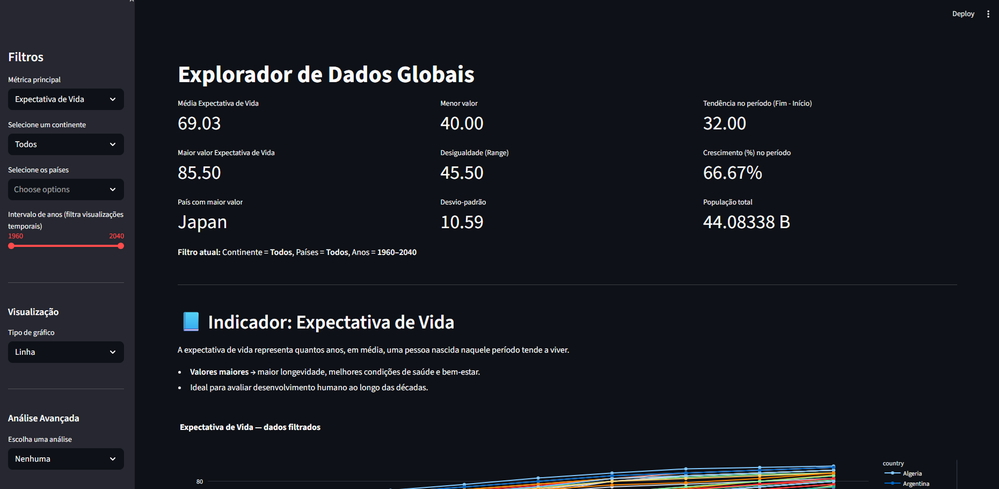
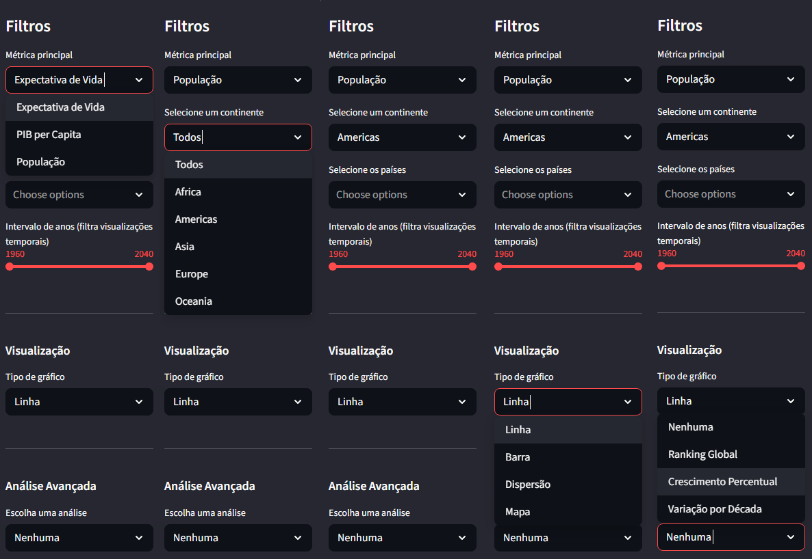
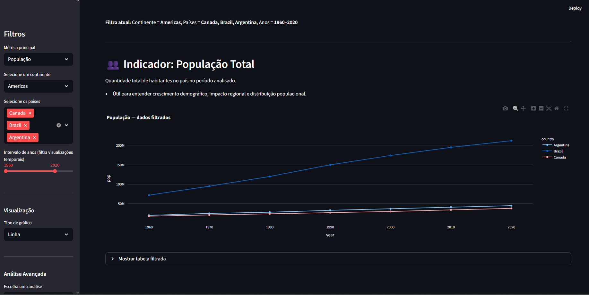
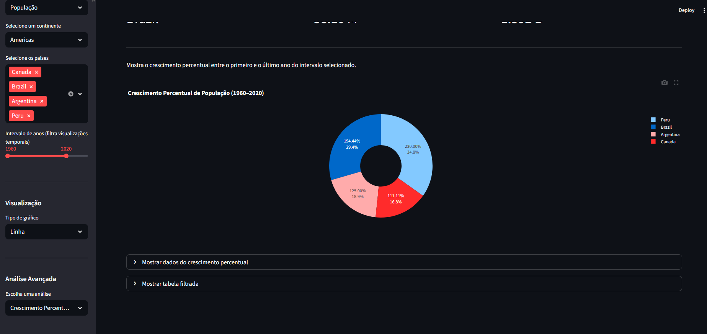
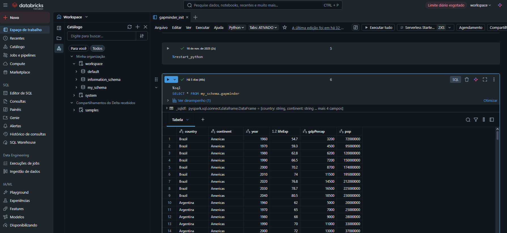

# 🌍 Gapminder App – Explorador de Dados Globais

Dashboard interativo feito com **Python + Streamlit**, permitindo visualizar a evolução global de **expectativa de vida, PIB per capita e população** entre 1960 e 2020 (com projeções até 2040).

---

## 🔗 Acesso ao app

👉 **https://exploradordadosglobais.streamlit.app**

---

# 🚀 Atualização v2.0 — Migração para CSV Local + Streamlit 100% Standalone

A versão mais recente remove totalmente a dependência do Databricks (que limitava o uso diário) e agora utiliza um **dataset local em CSV**, garantindo funcionamento contínuo, rápido e sem custos.

## O que mudou?

### ✅ 1. Databricks removido  
O Databricks Community Edition possuía:
- Limite diário de queries ❌  
- Clusters entrando em *sleep* ❌  
- Tokens expiram e precisam ser trocados ❌  

Agora o app funciona **sem nenhum serviço externo**.

### ✅ 2. Dados agora vêm de um CSV local  
Arquivo utilizado: `data/gapminder_completo.csv`  
Mesmos dados usados antes — só que mais rápido e totalmente estável.

### ✅ 3. Deploy no Streamlit Community Cloud  
O app agora roda **24/7, sempre online, gratuito e sem dependências externas**.

### 🧠 Por que essa mudança?
Para garantir que o projeto continue funcionando **perfeitamente no portfólio**, mesmo após meses sem uso, sem risco de limites, pausas ou expiração de credenciais.

---

# 🖼 Screenshots

### Tela Inicial  


### Filtros  


### População Total


### Crescimento Percentual


### (Histórico) Conexão com Databricks  
> Antes da versão 2.0, o app se conectava diretamente a uma tabela hospedada no Databricks.  


---

# 📊 Funcionalidades

- Filtros por continente, país e período  
- Gráficos dinâmicos:  
  - Linha  
  - Barra  
  - Dispersão  
  - Mapa  
- Ranking Global  
- Crescimento Percentual  
- Variação por Década  
- Tabela filtrada disponível a qualquer momento

---

# 🛠 Tecnologias Utilizadas

### Versão atual (v2.0)
- Python  
- Streamlit  
- Pandas  
- Plotly Express  
- CSV local (sem dependências externas)

### Versão anterior (v1.x)
- Conexão com Databricks SQL  
- Variáveis de ambiente (.env)

---

# ▶️ Como rodar localmente

## 1. Clone o repositório

```bash
git clone https://github.com/AndersonCarvalho96/gapminder-app.git
cd gapminder-app
```
## 2. Instale as dependências
```bash
pip install -r requirements.txt
```
## 3. Verifique se o arquivo CSV está no diretório correto
```bash
data/gapminder_completo.csv
```
## 4. Execute o app
``` bash
streamlit run app.py
```

# 🧱 Histórico do Projeto

## v1.0 – App conectado ao Databricks usando Databricks SQL

## v2.0 – Migração para CSV local + deploy no Streamlit Community Cloud

mais performance

maior estabilidade

zero custos

ideal para portfólio

Anderson Carvalho
🔗 GitHub: https://github.com/AndersonCarvalho96
